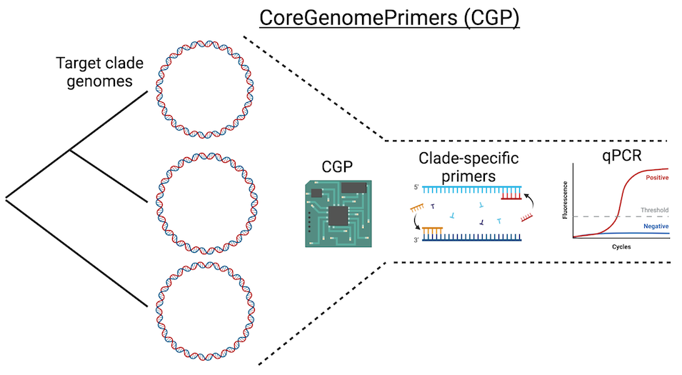
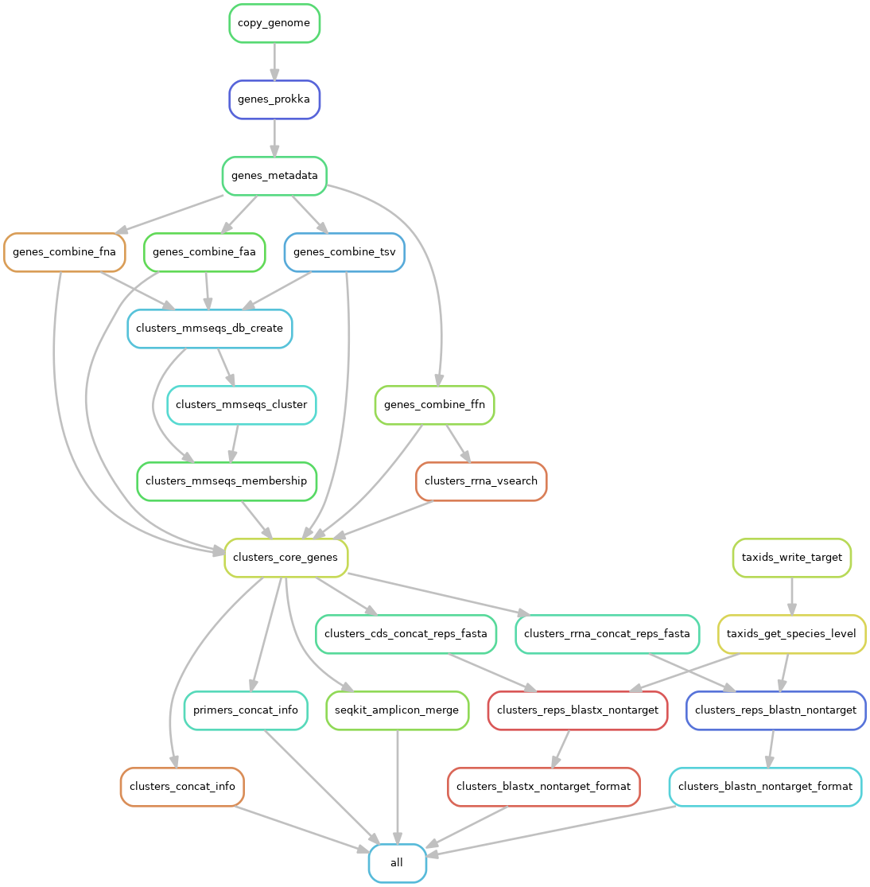

CoreGenomePrimers (CGP)
=======================



# Summary

Pangenome-guided primer design for clade-specific primer generation

**Overview of the method:**

* You provide a set of genomes for the target clade
  * e.g., all *Streptomyces griseus* genomes
* All coding & rRNA gene sequences for all genomes are clustered in order to find "core" genes
  * "core" = found in `X` fraction of members (set in the config)
    * "core" also means single-copy for CDS genes, by default (set in the config)
* For each core gene cluster:
  * Sequences are aligned to produce a multiple sequence alignment (MSA)
  * Primers are designed from the MSA via primer3
  * Non-specific primers are filtered based on blastn hits to non-target gene clusters
  * Non-specific primers are filtered based on blastn hits to non-target taxa
    * e.g., everything in NCBI-nt except for the target clade
* Supplemental info
  * BLAST-based gene annotations of each core gene cluster
  * **in silco** amplicons generated by `seqkit amplicon` 

# Pipeline overview

Rule graph:



# Workflow

* Input
  * Table of target genomes and related info
    * See [Pectobacterium.tsv](tests/data/Pectobacterium.tsv) for an example
  * Config file for setting pipeline parameters
    * See [config.yaml](./config.yaml)
* Core gene cluster identification
  * Genes called/annoated with `prokka`
  * Genes clustered with `mmseqs cluster` (or `linclust`)
  * Core genes defined by default as present in all members (and single copy) in each genome
* Primer design
  * Core genes aligned with `mafft`
  * Primers generated from the MSA via primer3
    * Method:
      * A majority-rule consensus sequence is generated from the MSA
        * Non-majority positions are assigned "N"
      * primer3 is used to design primers based on the consensus sequence
        * Only primers that are relatively conserved regions are generated
        * primer3 can constrain primer creation based on many criteria, such as:
          * amplicon length
          * melting temperature (Tm)
          * G+C content
      * The consensus sequence primers are not degenerate (primer3 cannot do that)
      * To add degeneracies and thus increase primer-set specificity to the gene region:
        * The sub-sequences of the MSA where the raw primers hit are extracted
	* A degenerate primer sequence is produced from all sub-sequences
  * The raw, degenerate primers are filtered by:
    * Total degeneracy
    * Degeneracy at the 3' end (higher degeneracy = less primer annealing)
  * Primers assessed for cross-hybridization to non-target genes in each target genome
    * blastn of primers against all gene clusters
    * blast hits filtered hit percent-identity, hit length, and amplicon size
  * Primers assessed for non-target hits to non-target taxa
    * The target clade is designated by the `Taxid` column in the input table.
      * All members in the database with that taxid will be excluded from the blast search.
    * blastn of primers against NCBI-nt (by default)
    * blast hits filtered hit percent-identity, hit length, and amplicon size
  * Final primer info is compiled in the output directory
* Supplemental info
  * Core genes BLAST'ed against nr (by default) while excluding the target clade in order to get most closely related non-target genes
    * This information can help prioritize primers that target core genes that are most unique to the target clade


# Install

## Snakemake

The pipeline utilizes [snakemake](https://snakemake.readthedocs.io/en/stable/).
We recommend that you install it via [conda](https://docs.conda.io/en/latest/miniconda.html) or mamba.

## Pipeline

```
git clone --recurse-submodules git@github.com:leylabmpi/CoreGenomePrimers.git
```

## Databases

### BLAST (nucl & prot)

Use `update_blastdb.pl` or another method 

### BLAST (rRNA)

See the [NCBI rRNA databases](https://ncbiinsights.ncbi.nlm.nih.gov/2020/02/21/rrna-databases/)

You can also download the `SSU` and `LSU` databases from ftp:/ftp/ebio/projects/CoreGenomePrimers/

### Gene names

You can download the gene names pkl file from ftp:/ftp/ebio/projects/CoreGenomePrimers/

### Taxonomy

See [taxonkit](https://bioinf.shenwei.me/taxonkit/)

You can also download the taxonomy files from ftp:/ftp/ebio/projects/CoreGenomePrimers/

### Notes

Make sure to update the file paths to the databases in the `config.yaml`

# Usage instructions

For general instuctions on using snakemake, see the [snakemake docs](https://snakemake.readthedocs.io/en/stable/).

## Input

### Samples file

Set in the `config.yaml` file via the `samples_file:` parameter

See [Pectobacterium.tsv](tests/data/Pectobacterium.tsv) for an example

A tab-delimited file with the following columns:

* `Taxon`
  * Taxon name for the genome
* `Fasta`
  * Path to the fasta file for the genome assembly
    * The assembly can be incomplete
    * Contig naming does not matter
* `Taxid`
  * NCBI taxonomy ID for the genome
    * This will be used to exclude this clade from BLAST searchers against non-target clades
    * If a non-species-level taxid is provided, taxonkit is used to find the species-level taxid(s)
      * BLAST `-negative_taxidlist` can only use species-level taxids
* `Domain`
  * Taxonomic domain of the genome (used by prokka) 

# Key config params

Example config file: [config.yaml](./config.yaml)

The default parameters in [config.yaml](./config.yaml) are set for qPCR design
(but no internal oligo).

The following are parameters that you most likely would want to change for your own needs.

* `core_genes:`
  * `--perc-genomes-(cds|rrna)`
    * The % of target genomes that must contain the gene cluster
  * `--copies-per-genome-(cds|rrna)`
    * The max number of copies in a genome in order to be considered "core"
  * `--max-clusters`
    * The max number of core genes that will be used for downstream analyses
* `blast_nontarget`
  * parameters for blast(n|x) of the core genes vs NCBI-nr (by default) in order to get non-target clade hits
* `align`
  * Parameters passed to mafft
* `primer3:
  * `number:`
    * `--num-primers`
      * Max number of raw primers generated
  * `size:`
    * Optimum/minimum/maximum primer size
  * `product:
    * Optimum/minimum/maximum primer amplicon size
  * `Tm:`
    * Optimum/minimum/maximum primer melting temperature
    * `--max-tm-diff`
      * The max allowable difference in Tm between oligos in the primer set
  * `GC:`
    * Optimum/minimum/maximum primer G+C content
  * `degeneracy:`
    * `--max-degeneracy`
      * Max degeneracy of the oligo
    * `--max-degeneracy-3prime`
      * Max degeneracy at the 3' end of either primer
    * `--window-3prime`
      * The size (bp) of the 3' region to consider for `--max-degeneracy-3prime`  
* `blastn:`
  * `-max_target_seqs`
    * increase for extra stringency when checking for non-target hits
  * `-perc_identity`
    * decrease for extra stringency when checking for non-target hits
* `blastn_filter:`
  * `--perc-len`
    * What % length of blast hit (`hit_len / query_len * 100`) is considered a legitimate hit?
  * `--(min|max)-amplicon-len`
    * fwd-rev primer hits generated amplicons outside of this size range will not be considered legitimate non-target hits    

# Output

## Notes on terminology

* `degenerate oligo` = oligo nucleotide sequence with degeneracies
  * Example: `ATACGTAY`
* `expanded oligo` = all non-degenerate sequences encoded by the degenerate sequence
  * Example: `ATACGTAY` = `(ATACGTAC, ATACGTAT)`

## Description

* `$OUTDIR/core_clusters_info.tsv`
  * General metadata on all core gene clusters
* `$OUTDIR/nontarget/*_blast*.tsv`
  * Formatted blast hits for a representative of each core gene cluster
  * Just blast hits to non-target taxa (default by `Taxid` column in the input table)
* `$OUTDIR/clusters/`
  * Core gene cluster fasta, alignment, and metadata files
* `$OUTDIR/primers_final/`
  * fasta files & metadata tables for each primer
  * `_degen.fna` => degenenerate primer sequences
  * `_expand.fna` => degeneracies "expanded" to non-ambiguous characters 
* `$OUTDIR/primers_final_info.tsv`
  * Summary info of all primers that passes all filtered
  * See below for column descriptions
* `$OUTDIR/amplicons.tsv`
  * **in silico** amplicons generated by `seqkit seq`
    * primer set search to target gene cluster

### Column descriptions

#### `$OUTDIR/core_clusters_info.tsv`

* `gene_type`
  * CDS or rRNA gene
* `cluster_id`
  * Numeric ID of the gene cluster 
* `seq_uuid`
  * Universal unique ID given to the gene sequence
* `seq_orig_name`
  * Original gene annotation (replaced by the UUID for use in the pipeline)
* `contig_id`
  * Name of the contig that contains the gene
* `taxon`
  * Name of the taxon that contains the gene
* `start`
  * Start position (bp) on the contig containing the gene
* `end`
  * End position (bp) on the contig containing the gene
* `score`
  * Prodigal annotation score
* `strand`
  * Sequence strand that contains the contig
* `cluster_name`
  * Name of the cluster (the `seq_uuid` of the cluster representative sequence)

#### `$OUTDIR/primers_final_info.tsv`

* `gene_type`
  * CDS or rRNA gene
* `cluster_id`
  * The ID of the core gene cluster
* `primer_set`
  * The ID of the primer set
  * NOTE: The primer sets are numbered per-cluster, so IDs repeat among gene clusters
* `amplicon_size_consensus`
  * Amplicon size (bp) of the gene cluster alignment consensus sequence 
* `amplicon_size_avg`
  * Average size (bp) of the putative amplicons
  * This may differ from `amplicon_size_consensus` due to gaps in some of the gene sequences
* `amplicon_size_sd`
  * Standard deviation of sizes (bp) of the putative amplicons
* `primer_id`
  * `primer_set` + `[f,r,i]`
    * `f` = forward primer
    * `r` = reverse primer
    * `i` = internal oligo
* `primer_type`
  * `PRIMER_RIGHT` = forward primer
  * `PRIMER_LEFT` = reverse primer
  * `PRIMER_INTERNAL` = interal oligo
* `sequence`
  * Oligo sequence
* `length`
  * Oligo length
* `degeneracy`
  * Oligo degeneracy
* `degeneracy_3prime`
  * Degeneracy only at the 3' end of the oligo
  * The 3' end is determined via `--window-3prime`
* `position_start`
  * Start position of the oligo on the gene cluster MSA consensus sequence
* `position_end`
  * End position of the oligo on the gene cluster MSA consensus sequence
* `Tm_avg`
  * Average melting temperature for all expanded oligo sequences
* `Tm_sd`
  * Standard deviation of melting temperatures for all expanded oligo sequences
* `GC_avg`
  * Average G+C content for all expanded oligo sequences
* `GC_sd`
  * Standard deviation of G+C contents for all expanded oligo sequences
* `hairpin_avg`
  * Average oligo hairpin melting temperature for all expanded oligo sequences
* `hairpin_sd`
  * Standard deviation of oligo hairpin melting temperatures for all expanded oligo sequences
* `homodimer_avg`
  * Average oligo homodimer melting temperature for all expanded oligo sequences
* `homodimer_sd`
  * Standard deviation of oligo homodimer melting temperatures for all expanded oligo sequences

#### `$OUTDIR/nontarget/*_blast*.tsv`

* `cluster_id`
  * Core gene cluster ID number
* `query`
  * The `seq_uuid` of the core gene cluster representative sequence
* `subject`
  * The accession of the BLAST subject
* `subject_name`
  * The gene annotation (and taxonomy) of the subject
* Other columns
  * See the BLAST documentation for column descriptions

#### `$OUTDIR/amplicons.tsv`

* `gene_type`
  * CDS or rRNA gene
* `cluster_id`
  * Core gene cluster ID number
* `gene_id`
  * The `seq_uuid` of the gene sequence in the cluster
* `start`
  * amplicon start position
* `end`
  * amplicon end position
* `primer_set`
  * The ID of the primer set
  * NOTE: The primer sets are numbered per-cluster, so IDs repeat among gene clusters
* `score`
  * ignore
* `strand`
  * strand of amplicon
* `amplicon`
  * amplicon sequence

# Misc

## Summarizing primer design/filtering logs

See ./utils/primer_log_summary.py

  
